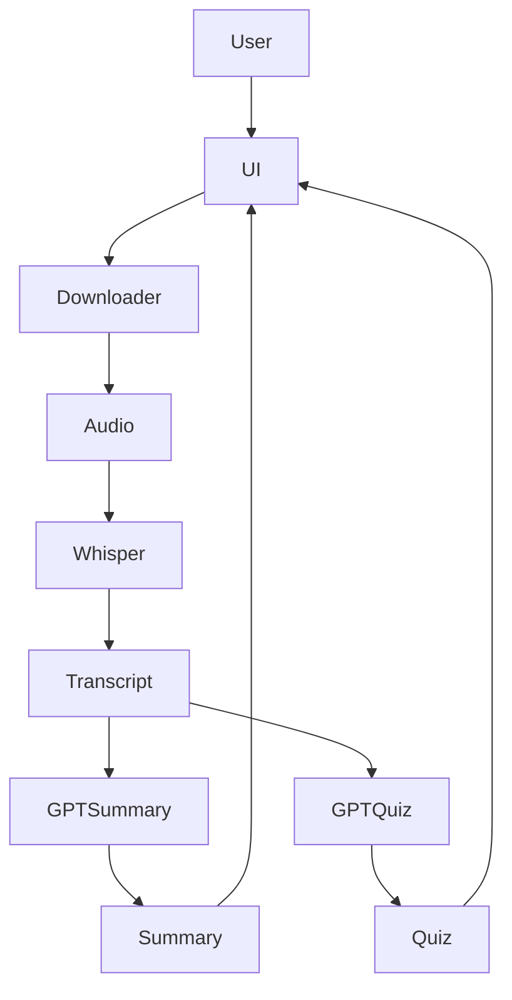

# YouTube Transcript Suite — Download • Transcribe • Summarize • Quiz


An end-to-end **AI pipeline** that downloads YouTube audio, transcribes speech, generates summaries, and creates interactive quizzes to assess understanding.

Built for **learning, education, and knowledge extraction**.

> Download → Transcribe → Summarize → Learn

---

## Screenshots

<p align="center">
  
  
  
</p>

<p align="center">
  
  
  
</p>

---

## What It Does

### ✅ Download Pipeline
- Accepts YouTube URL
- Downloads audio safely
- Supports cookies (optional)
- Uses FFmpeg for audio processing

### ✅ Speech Transcription
- Whisper-based transcription
- Converts speech → text
- Saves transcripts locally
- Handles long videos

### ✅ AI Summary Engine
- GPT-powered summarization
- Key takeaways extraction
- Structured summaries
- Important terms & concepts

### ✅ Interactive Quiz Generator
- Auto-generated questions
- Multiple choice answers
- Instant scoring
- Feedback with explanations

---

## Architecture



---

## Tech Stack

- Python
- Streamlit UI
- OpenAI Whisper
- GPT-4o
- FFmpeg
- yt-dlp
- Prompt Engineering
- Local file pipeline

---

## Quick Start

```bash
git clone https://github.com/YOUR_REPO/youtube-transcript-suite.git
cd youtube-transcript-suite

python -m venv venv
venv\Scripts\activate

pip install -r requirements.txt
streamlit run streamlit_app.py
```

---

## Configuration

Create `.env` file:

```
OPENAI_API_KEY=your_key_here
```

Optional:

- Set FFmpeg path in UI settings
- Add cookies.txt if downloading restricted videos

---

## Project Structure

```
youtube-transcript-suite/
├── assets/
│   ├── screenshot1.png
│   ├── screenshot2.png
│   ├── screenshot3.png
│   ├── screenshot4.png
│   ├── screenshot5.png
│   └── screenshot6.png
├── streamlit_app.py
├── requirements.txt
├── README.md
```

---

## Use Cases

- Study YouTube lectures
- Summarize long tutorials
- Create learning quizzes
- Extract notes automatically
- Educational content digestion

---

## This project demonstrates

✅ Speech-to-text pipelines  
✅ AI summarization workflows  
✅ automated quiz generation  
✅ full end-to-end ML app  
✅ human-AI learning loop  

This is not just transcription.  
This is **AI-powered learning automation**.

---

## License

MIT
