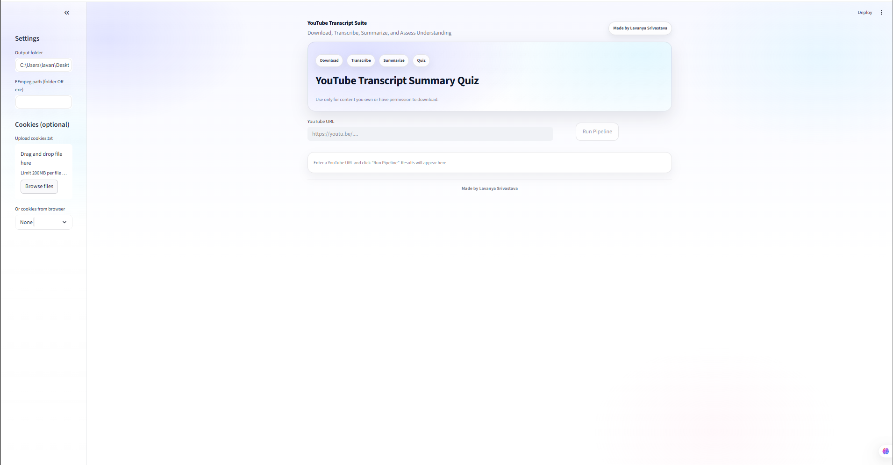
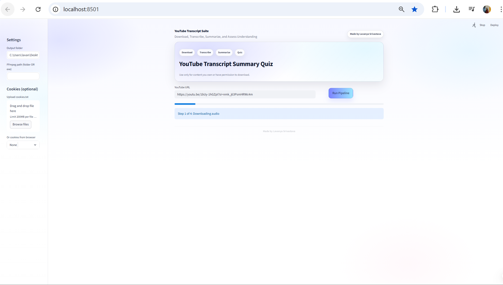
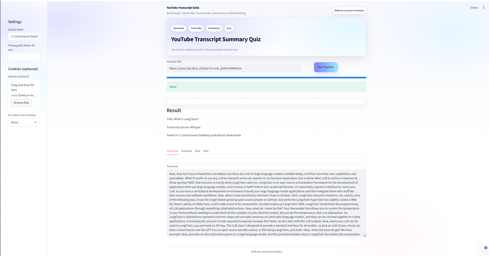
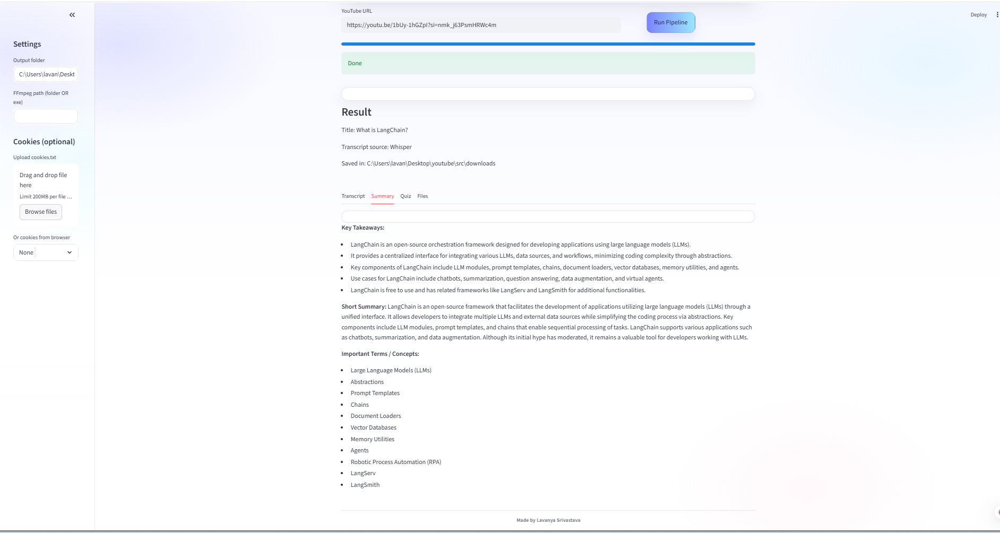
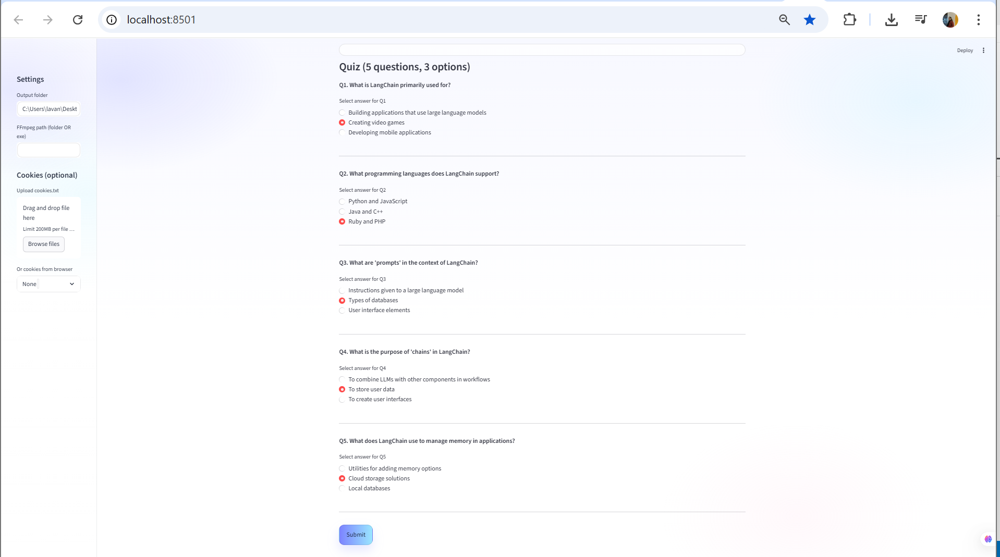
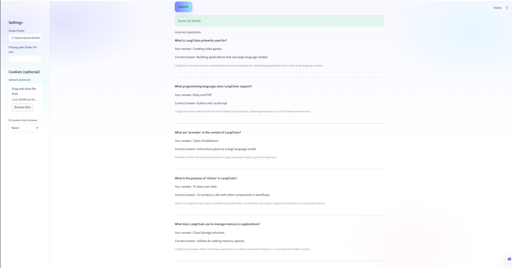
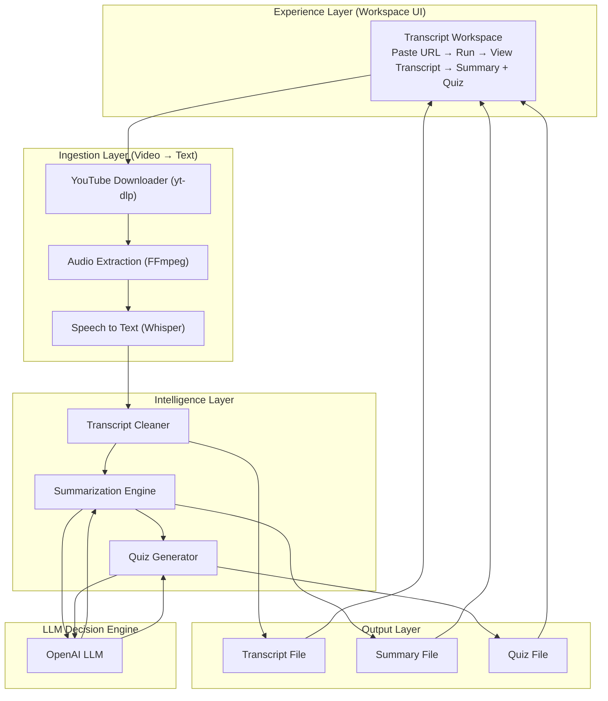

# YouTube Transcript Suite — Download • Transcribe • Summarize • Quiz


An end-to-end **AI pipeline** that downloads YouTube audio, transcribes speech, generates summaries, and creates interactive quizzes to assess understanding.

Built for **learning, education, and knowledge extraction**.

> Download → Transcribe → Summarize → Learn

---

## Screenshots

<p align="center">
  
  
  
</p>

<p align="center">
  
  
  
</p>

---

## What It Does

### Download Pipeline
- Accepts YouTube URL
- Downloads audio safely
- Supports cookies (optional)
- Uses FFmpeg for audio processing

### Speech Transcription
- Whisper-based transcription
- Converts speech → text
- Saves transcripts locally
- Handles long videos

### AI Summary Engine
- GPT-powered summarization
- Key takeaways extraction
- Structured summaries
- Important terms & concepts

### Interactive Quiz Generator
- Auto-generated questions
- Multiple choice answers
- Instant scoring
- Feedback with explanations

---

## Architecture




## Tech Stack

- Python
- Streamlit UI
- OpenAI Whisper
- GPT-4o
- FFmpeg
- yt-dlp
- Prompt Engineering

---

## Quick Start

```bash
python -m venv venv
venv\Scripts\activate
pip install -r requirements.txt
streamlit run streamlit_app.py
```

---

## Files

```
streamlit_app.py
test_openai.py
test_speech.py
requirements.txt
Dockerfile
README.md
assets/
```

---

## Use Cases

- Study YouTube lectures
- Summarize tutorials
- Create learning quizzes
- Auto note generation

---

## License

MIT
